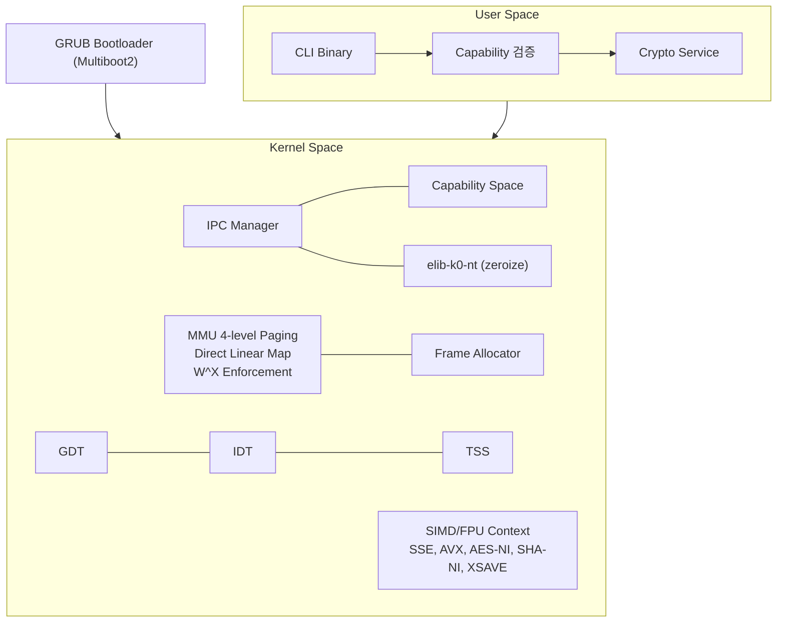
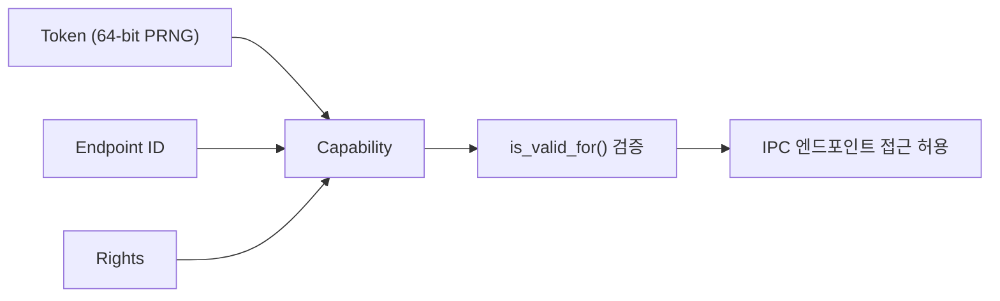
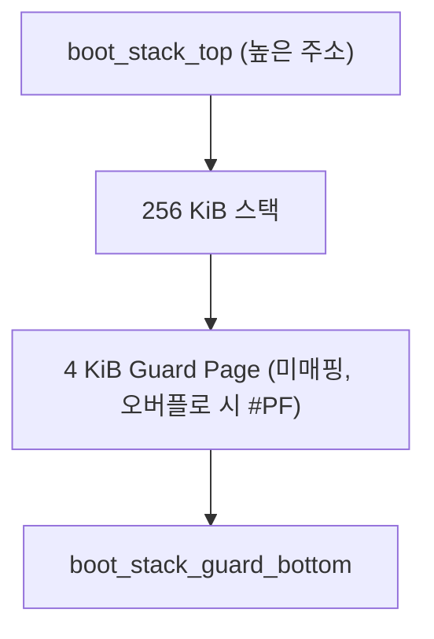
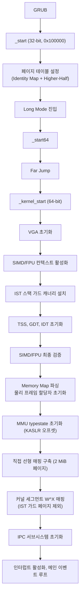

# Introduction

`iso-light-k0`은 다양한 아키텍처와 베어메탈 환경을 타겟으로 하는 **초경량 보안 마이크로커널**입니다. Rust `no_std`에서 메모리 안전성을 보장하며, **Capability-based Access Control**과 **동기 IPC**으로 최소 권한 원칙을 구현합니다. 암호 프리미티브는 [`elib-k0-nt`](https://github.com/Quant-Off/elib-k0-nt)의 크레이트를 활용합니다.

본 마이크로커널은 높은 보안성을 목표로 합니다. 모든 구현은 최소 권한 원칙과 격리(Isolation)를 극대화한 설계를 따르며, 메모리 안전성은 Rust 언어 자체의 소유권 시스템으로 보장됩니다.

## 핵심 특징

Rust 기반 메모리 안전성으로 `unsafe`을 최소화하고, `alloc` 없이 정적 할당만 사용합니다. **Capability-based Access Control**으로 위조 불가 토큰 기반 자원 접근 제어를 수행하며, **Rendezvous Model**의 동기 IPC로 메시지 패싱 기반 프로세스 간 통신을 구현합니다. **W^X**으로 쓰기 가능 페이지의 실행을 MMU 레벨에서 차단하고, **Higher-Half**으로 커널과 사용자 공간을 완전히 분리합니다. 보안 메모리 소거는 `elib-k0-nt`의 zeroize 크레이트로 volatile write을 보장합니다.

또한, **SIMD/FPU 컨텍스트**를 활성화하여 x87/SSE/AVX와 AES-NI, SHA-NI 하드웨어 가속을 지원하며, **가드 페이지 기반 스택 보호**으로 IST 및 부트 스택 오버플로를 즉시 탐지합니다.

## Architecture

## Modules

각 기능은 다음과 같이 개별 모듈로 분리되어 관리됩니다.

- `main.rs`: 커널 진입점과 부팅 시퀀스
- `boot.rs`: GDT 초기화와 세그먼트 설정 
- `boot_stub.rs`: Multiboot2 헤더와 32-bit -> 64-bit 전환 및 256 KiB 부트 스택 처리
- `mmu.rs`: 4단계 페이지 테이블, KASLR, W^X 정책
- `capability.rs`: Capability-based Access Control 구현
- `ipc.rs`: 동기 메시지 패싱(랑데부, rendezvous)
- `idt.rs`: 인터럽트 디스크립터 테이블과 IST 인덱스 설정을 담당
- `tss.rs`: Task State Segment와 IST 스택(가드 페이지 포함)
- `stack.rs`: IST 스택 레이아웃과 가드 페이지 캐너리(canary) 관리 처리
- `cpu.rs`: SIMD/FPU 컨텍스트 활성화와 CPUID 기능 탐지
- `allocator.rs`: 비트맵 기반 물리 프레임 할당자
- `vga.rs`: VGA 텍스트 모드 출력 제공

## Security

### Capability-based Access Control

`Capability`은 $64$-bit PRNG 토큰, Endpoint ID, Rights의 조합으로 구성됩니다. 토큰 없이는 IPC 엔드포인트 접근이 불가하며, **GRANT** 권한으로만 부분 위임이 가능합니다(축소 원칙). 사용 종료 시 `Secret<T>`로 토큰이 즉시 소거됩니다.

### Zeroize

외부 `elib-k0-nt`의 zeroize 크레이트로 보안 메모리 소거를 수행합니다. `volatile::secure_zero()`은 컴파일러 최적화 차단 메모리 소거를, `Secret<T>`은 스코프 종료 시 자동 소거되는 민감 데이터 래퍼를 제공하며, `compiler_fence(SeqCst)`은 메모리 순서 보장 배리어로 사용됩니다.

### W^X Policy

쓰기 가능(`WRITABLE`) 페이지는 자동으로 실행 불가(`NO_EXECUTE`)으로 설정됩니다. 코드 삽입 공격을 원천 차단하며, MMU 엔트리 설정 레벨에서 강제됩니다.

### SIMD/FPU Context

`cpu.rs`은 x87/SSE/AVX 컨텍스트를 활성화하여 `elib-k0-nt`의 암호 프리미티브가 SIMD 명령어를 사용할 수 있게 합니다.

| Register | Configuration                                                                 |
|----------|-------------------------------------------------------------------------------|
| `CR0`    | $`\texttt{EM}=0,\ \texttt{TS}=0,\ \texttt{MP}=1,\ \texttt{NE}=1`$             |
| `CR4`    | $`\texttt{OSFXSR}=1,\ \texttt{OSXMMEXCPT}=1,\ \texttt{OSXSAVE}=1`$ (AVX 지원 시) |
| `XCR0`   | x87 + SSE + AVX 상태 컴포넌트 활성화                                                   |

CPUID로 탐지되는 하드웨어 기능에는 SSE/SSE2/SSE3/SSSE3/SSE4.1/SSE4.2, AVX/AVX2, **AES-NI**(하드웨어 AES 가속), **SHA-NI**(하드웨어 SHA 가속), `RDRAND`/`RDSEED`(하드웨어 난수), `XSAVE`(확장 상태 저장)이 포함됩니다.

## Stack Protection

### Boot Stack

부트 스택은 $256\ \text{KiB}$로 확장되었으며, 최하단에 $4\ \text{KiB}$ 가드 페이지가 배치됩니다. MMU 활성화 후 가드 영역은 미매핑되어 오버플로 시 즉시 `#PF`이 발생합니다.

### IST (Interrupt Stack Table)

치명 예외 전용 스택을 독립적으로 분리하여, 커널 주 스택이 망가진 상태에서도 핸들러가 안전한 컨텍스트에서 실행되도록 합니다.

| IST    | Exception                     | Stack                                  |
|--------|-------------------------------|----------------------------------------|
| `IST1` | `#DF` Double Fault            | $64\ \text{KiB} + 4\ \text{KiB}$ Guard |
| `IST2` | `#NMI` Non-Maskable Interrupt | $32\ \text{KiB} + 4\ \text{KiB}$ Guard |
| `IST3` | `#MC` Machine Check           | $32\ \text{KiB} + 4\ \text{KiB}$ Guard |
| `IST4` | `#PF` Page Fault              | $64\ \text{KiB} + 4\ \text{KiB}$ Guard |

MMU 활성화 전에는 캐너리 패턴(`0xDEADBEEFCAFEF00D`)으로 소프트웨어 검증을 수행합니다.

## Memory Layout

가상 주소 공간은 48-bit canonical 모델을 따릅니다.

| Address                 | Region            | Description                                                   |
|-------------------------|-------------------|---------------------------------------------------------------|
| `0xFFFF_FFFF_8000_0000` | `KERNEL_VMA_BASE` | Higher-Half (`.text` R+X, `.rodata` R, `.data` RW, `.bss` RW) |
| `0xFFFF_8000_0000_0000` | `PHYS_MAP_OFFSET` | Direct Linear Map ($2\ \text{MiB}$ 대용량 페이지)                   |
| `0x0000_0000_0010_0000` | `PHYS_LOAD_BASE`  | GRUB 로드 위치 ($1\ \text{MiB}$)                                  |
| `0x0000_0000_0000_0000` | Reserved          | BIOS, VGA, IVT                                                |

## Boot Sequence

## IPC Endpoints

| ID       | Name        | Description |
|----------|-------------|-------------|
| `0x0000` | `EP_SYSTEM` | 커널 시스템 콜    |
| `0x0001` | `EP_CRYPTO` | 암호화 서비스     |

## elib-k0-nt Integration

`elib-k0-nt`의 암호 프리미티브를 활용하며, SIMD/FPU 컨텍스트가 활성화되어 있어 하드웨어 가속이 가능합니다.

| Crate      | Description                          |
|------------|--------------------------------------|
| `zeroize`  | 보안 메모리 소거, `Secret<T>` 래퍼            |
| `aes`      | AES-128/192/256, AES-GCM (AES-NI 가속) |
| `chacha20` | ChaCha20-Poly1305 AEAD               |
| `sha2`     | SHA-256, SHA-384, SHA-512            |
| `sha3`     | SHA3, SHAKE128/256                   |
| `blake`    | BLAKE3                               |
| `rng`      | Hash DRBG                            |
| `ed25519`  | Ed25519 서명                           |
| `ed448`    | Ed448 서명                             |
| `x25519`   | X25519 키 교환                          |
| `x448`     | X448 키 교환                            |
| `mldsa`    | ML-DSA(Dilithium) 포스트양자 서명           |
| `mlkem`    | ML-KEM(Kyber) 포스트양자 키 캡슐화            |

## Roadmap

향후 계획에는 HSM 드라이버 인터페이스(추상화 트레이트), `RDRAND`/`RDSEED` 기반 CSPRNG, 사용자 공간 프로세스 로더, 스케줄러 연동(IPC 블로킹), TUI 프레임버퍼 렌더링 엔진, ARM64 타겟 지원이 포함됩니다.
