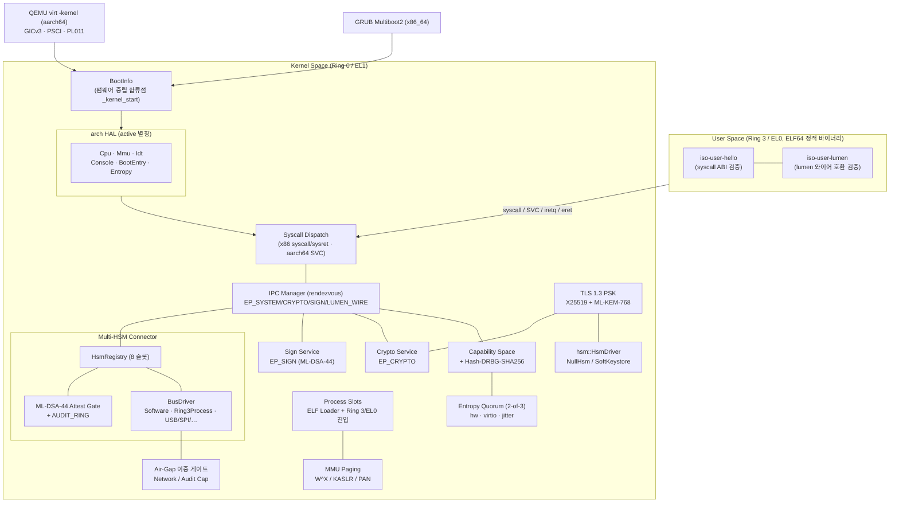
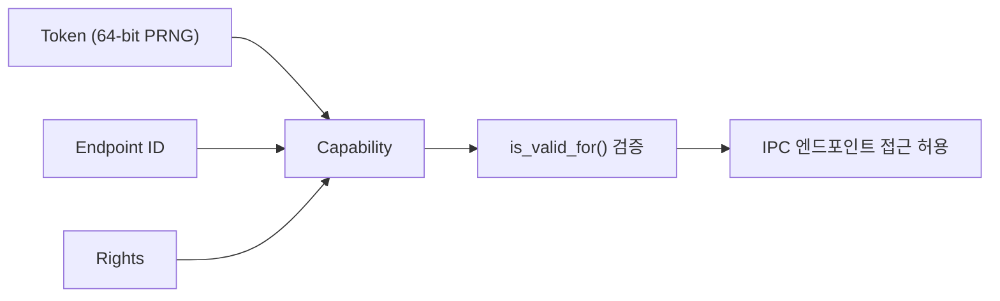
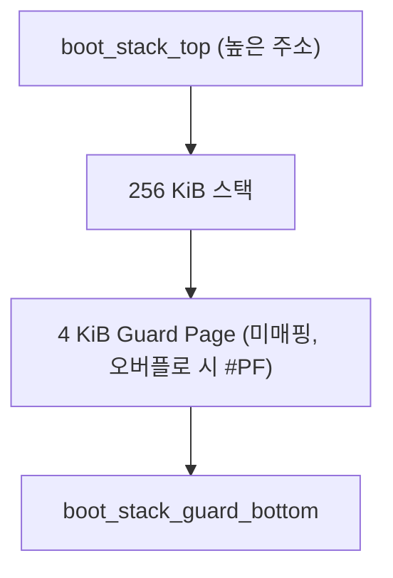
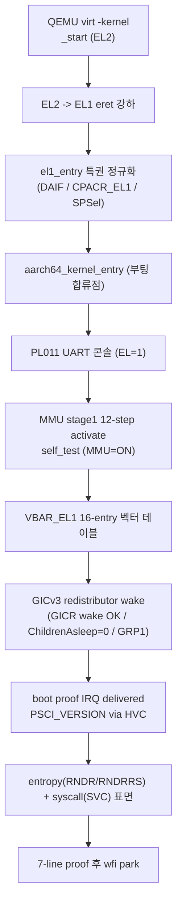

# Introduction

[](INTRODUCTION_EN.md)
[](https://discord.gg/9utg4hp3m8)

ISO-LIGHT-K0는 고보안 엣지 게이트웨이, 항공·군수 임베디드 단말, 폐쇄망 데이터 다이오드를 타겟으로 하는 **초경량 `no_std` 보안 마이크로커널**입니다. Rust의 소유권 시스템으로 메모리 안전성을 보장하고, **x86_64와 aarch64** 두 아키텍처를 단일 코드베이스에서 지원하며, 동적 할당(`alloc`) 없이 정적 할당과 스택만으로 동작합니다. 암호 프리미티브는 [`elib-k0-nt`](https://github.com/Quant-Off/elib-k0-nt)의 크레이트만 활용합니다.

이 마일스톤의 핵심 목표는 **Multi-HSM Connector**입니다. 사용자가 임의의 신뢰 가능한 HSM(소프트 키스토어, Ring 3 lumen, 향후 USB·SPI·스마트카드)을 커널에 안전하게 부착하고, 커널이 그들 사이의 데이터 중계를 zero-trust·constant-time·동적 할당 0으로 매개합니다. lumen은 커널 안으로 들어오지 않고, 커널이 정의하는 wire 프로토콜의 클라이언트로만 취급됩니다.

본 마이크로커널은 높은 보안성을 목표로 합니다. 모든 구현은 최소 권한 원칙과 격리(Isolation)를 극대화한 설계를 따르며, 메모리 안전성은 Rust 언어 자체의 소유권 시스템으로 보장됩니다.

## 핵심 특징

**멀티 아키텍처 (HAL)** - x86_64와 aarch64를 단일 코드베이스에서 지원합니다. 아키텍처 중립 계약을 6개 HAL 트레이트(`Cpu` `Mmu` `Idt` `Console` `BootEntry` `Entropy`)로 강제하며, 활성 타겟은 `arch::active` 별칭으로 노출됩니다. x86_64는 GRUB Multiboot2 ISO로, aarch64는 QEMU virt `-kernel` 직접 부팅(GICv3, PSCI over HVC, PL011 UART, MMU stage1)으로 진입하고, 펌웨어 중립 `BootInfo` 구조가 Multiboot2·UEFI·DTB 핸드오프를 단일 합류점(`_kernel_start`)으로 수렴시킵니다.

**Zero-Trust 격리** - Rust 기반 메모리 안전성으로 `unsafe`을 최소화하고 정적 할당만 사용합니다. **Capability-based Access Control**으로 위조 불가 토큰 없이는 IPC 엔드포인트에 접근할 수 없으며, **W^X**으로 쓰기 가능 페이지의 실행을 MMU 레벨에서 차단하고 **Higher-Half**으로 커널과 사용자 공간을 분리합니다. x86_64의 `CR0.WP` + `CR4.SMEP/SMAP/UMIP`, aarch64의 PAN이 사용자 메모리 접근 창을 이중 통제하며, 가드 페이지 기반 스택 보호로 IST 및 부트 스택 오버플로를 즉시 탐지합니다. 보안 메모리 소거는 `elib-k0-nt`의 zeroize 크레이트로 volatile write을 보장하고, 모든 토큰/MAC 비교는 `constant-time` 크레이트로 부채널 공격(Side-Channel Attack)을 차단합니다.

**커널 내장 암호 서비스** - **Crypto Service**(EP_CRYPTO: AES-256-GCM, ChaCha20-Poly1305, BLAKE3, SHA-2/3, HKDF, Ed25519/Ed448, X448 DH), **PQ Sign Service**(EP_SIGN: ML-DSA-44 청크 프로토콜), **TLS 1.3 PSK 핸드셰이크**(Closed/External 프로필, `psk_pq_hybrid_ke` = X25519 + ML-KEM-768)를 제공합니다.

**Multi-HSM Connector** - 최대 8개 슬롯의 `HsmRegistry`와 `bus::BusDriver` 추상 트레이트로 이질적 HSM을 동시 부착합니다. attach 시점 ML-DSA-44 어테스테이션 게이트가 신뢰 루트를 검증하고, `SoftwareBus`(소프트 HSM)·`Ring3ProcessBus`(lumen wire) 구현이 `LWK0` wire 프로토콜로 데이터를 중계하며, 32-entry AUDIT_RING이 부착·중계 이벤트를 기록합니다. 장기 비밀(PSK)은 이와 별개로 `hsm::HsmDriver` 추상 트레이트(NullHsm / SoftKeystore 폴백)로 노출되어 TLS 코드 경로가 HSM·소프트 양쪽에서 재사용됩니다.

**Air-Gapped Ready + 엔트로피 쿼럼** - 외부망 통신은 `tls-external` 빌드 feature + 런타임 capability 이중 게이트를 모두 통과해야만 허용되며, 기본 `closed` 프로필은 네트워크 심볼 자체가 부재해 공격면이 0이고 부팅 시 `gap_self_check`로 이를 검증합니다. 엔트로피는 하드웨어 난수(x86 RDRAND/RDSEED, aarch64 RNDR/RNDRRS)·virtio-rng·jitter 3소스를 NIST SP 800-90B health test로 평가한 뒤 production 2-of-3 쿼럼으로 결합하고, 미달 시 fail-close 합니다.

또한 **SIMD/FPU 컨텍스트**(x86_64)를 활성화하여 x87/SSE/AVX와 AES-NI 및 SHA-NI 하드웨어 가속을 지원합니다.

## Architecture



## Modules

각 기능은 다음과 같이 개별 모듈로 분리되어 관리됩니다.

**부팅 / 펌웨어 중립 계층**

- `main.rs`: 커널 진입점, 모듈 배선, 아키텍처 중립 `_kernel_start` 합류점
- `boot/mod.rs`: 펌웨어 중립 `BootInfo` (Multiboot2 / UEFI / DTB 핸드오프를 단일 구조로 수렴)
- `boot/memory_map.rs`: 물리 메모리 맵 (+ KASLR 커스텀 태그)
- `boot/uefi.rs`: UEFI 핸드오프 표면 (Phase 11 stub)
- `panic.rs`: 정보 유출 없는 즉각 halt 패닉 핸들러
- `stack.rs`: IST 및 부트 스택 레이아웃과 가드 페이지 캐너리(canary) 관리

**arch HAL** (`arch/mod.rs`: 6 트레이트 정의 + `active` 별칭 cfg 배선)

- `arch/common/`: 아키텍처 중립 `syscall`(`SyscallNum` 호출 카탈로그) + `entropy` 서브트리
- `arch/x86_64/`: `boot_stub`(Multiboot2 헤더 + 32->64 전환 + 256 KiB 부트 스택), `multiboot2`, `kernel_start`, `cpu`(SIMD/FPU + SMEP/SMAP/UMIP), `gdt` / `idt` / `tss`, `mmu`(4단계 페이징 + W^X + KASLR), `vga`, `syscall`, `process_entry`, `entropy`(RDRAND/RDSEED + virtio)
- `arch/aarch64/`: `boot_stub`(EL2->EL1 eret 강하), `boot`(부팅 합류점), `cpu`(DAIF/CPACR_EL1/PAN), `vectors`(16-entry + VBAR_EL1), `mmu`(stage1 + 48-bit VA + TTBR split), `gic`(GICv3 redistributor wake), `psci`(PSCI over HVC), `console`(PL011 UART), `syscall`(SVC), `process_entry`(EL0 강하), `entropy`(RNDR/RNDRRS)

**메모리**

- `allocator.rs`: 비트맵 기반 물리 프레임 할당자, 해제 시 `zeroize::secure_zero`

**Capability / IPC / 사용자 공간**

- `capability.rs`: Capability-based Access Control 구현 + Hash-DRBG-SHA-256 (RDSEED/RDRAND 시드)
- `ipc.rs`: 동기 메시지 패싱(랑데부, rendezvous), `EP_SYSTEM`/`EP_CRYPTO`/`EP_SIGN`/`EP_LUMEN_WIRE` 등록
- `process.rs`: 정적 프로세스 슬롯, 사용자 PML4 + ELF PT_LOAD 매핑, Ring 3 진입(`cr3` + `swapgs` + `iretq`)
- `elf.rs`: 정적 ELF64 (`ET_EXEC`/`ET_DYN` + `EM_X86_64`) 파서, PT_LOAD 검증

**커널 내장 서비스**

- `crypto_service.rs`: `EP_CRYPTO` 디스패처: AES-256-GCM, ChaCha20-Poly1305, BLAKE3, SHA-2/3, HMAC-SHA-256, HKDF, Ed25519/Ed448 sign/verify, X448 DH
- `sign_service.rs`: `EP_SIGN` ML-DSA-44 청크 프로토콜 (Begin -> InChunk -> Exec -> OutChunk -> End)
- `hsm.rs`: PSK 접근용 HSM 추상 트레이트 `HsmDriver`, `PskId`, `NullHsm` (HSM 미공급 폴백)
- `keystore.rs`: 정적 풀 PSK Soft Keystore, `Provisioned` -> `Wiped` 단방향 lifecycle
- `tls/` (mod, handshake, keyschedule, record, transcript): TLS 1.3 PSK (`psk_dhe_ke` / `psk_pq_hybrid_ke`), Closed/External 프로필, AEAD 레코드, HKDF-Expand-Label, 트랜스크립트 SHA-256

**Multi-HSM Connector**

- `hsm_registry.rs`: 8-슬롯 `HsmRegistry`, `HsmCapability`(16 bytes), attach/detach/enumerate/write/relay/read 핸들러
- `bus.rs`: `BusDriver` 추상 트레이트 + `SoftwareBus`(64B 루프백) / `Ring3ProcessBus`(lumen wire) + `LWK0` wire 프로토콜(`WireFrameHeader` 16B, `WireCmd`, `WireStatus`)
- `hsm_attest.rs`: ML-DSA-44 어테스테이션 verifier(`verify_attest`) + 신뢰 루트 dual-path(`init_trust_root`) + 32-entry `AUDIT_RING`
- `air_gap.rs`: 외부망 이중 게이트(`NETWORK_ATTACH_CAP`) + 감사 조회(`AUDIT_READ_CAP`, `sys_hsm_status` 456옥텟) + `gap_self_check` 부팅 fail-stop
- `arch/common/entropy/`: `quorum`(2-of-3 정책) + `health`(SP 800-90B StreamHealth) + `jitter` + `virtio_rng`

**임베드 사용자 크레이트**

- `crates/iso-user-hello/`: Ring 3 진입 + `sys_write` / `sys_getrandom` / `sys_exit` 동작 검증
- `crates/iso-user-lumen/`: [lumen](https://github.com/Quant-Off/lumen) 프로젝트의 `elib-k0-nt` 와이어 호환성(BLAKE3 / BLAKE3-keyed / Ed25519 결정성 / X25519 ECDH / AES-256-GCM)을 Ring 3 에서 실증
- `build.rs`: 사용자 ELF 를 `OUT_DIR` 로 복사 -> 환경변수 `ISO_USER_HELLO_ELF` / `ISO_USER_LUMEN_ELF` 노출 -> `include_bytes!` 임베드 (미빌드 시 4-byte placeholder 로 graceful degrade)

## Security

### Capability-based Access Control

`Capability`은 $64$-bit PRNG 토큰, Endpoint ID, Rights의 조합으로 구성됩니다. 토큰 없이는 IPC 엔드포인트 접근이 불가하며, **GRANT** 권한으로만 부분 위임이 가능합니다(축소 원칙). 사용 종료 시 `Secret<T>`로 토큰이 즉시 소거됩니다.



### Zeroize

외부 `elib-k0-nt`의 zeroize 크레이트로 보안 메모리 소거를 수행합니다. `volatile::secure_zero()`은 컴파일러 최적화 차단 메모리 소거를, `Secret<T>`은 스코프 종료 시 자동 소거되는 민감 데이터 래퍼를 제공하며, `compiler_fence(SeqCst)`은 메모리 순서 보장 배리어로 사용됩니다.

### W^X Policy

쓰기 가능(`WRITABLE`) 페이지는 자동으로 실행 불가(`NO_EXECUTE`)으로 설정됩니다. 코드 삽입 공격을 원천 차단하며, MMU 엔트리 설정 레벨에서 강제됩니다(x86_64 4단계 페이징 / aarch64 stage1 공통).

### HSM 추상화 + Soft Keystore 폴백

장기 비밀(PSK)에 대한 모든 접근은 `hsm::HsmDriver` 트레이트로 노출됩니다. HSM 환경에서는 HMAC 연산이 HSM 내부 엔진에서 수행되어 PSK가 메모리에 노출되지 않으며, 폐쇄망에서 HSM 이 없는 환경은 `keystore::SoftKeystore` 가 정적 풀 기반 폴백을 제공합니다. PSK 슬롯은 `Empty -> Provisioned -> Wiped` 단방향 lifecycle 로 운영되어 식별자 재사용 공격을 차단합니다. `psk_exists()` 검사는 `constant-time` 으로 수행되며, `Secret<[u8; MAX_PSK_LEN]>` 으로 키 자료가 보호됩니다.

| Implementation | Use case                                                      |
|----------------|---------------------------------------------------------------|
| `NullHsm`      | HSM·PSK 미공급 환경: TLS 핸드셰이크가 부팅 단계에서 즉시 fail-stop               |
| `SoftKeystore` | 폐쇄망 사전 분배 PSK: `provision()` 으로 등록, `wipe_all()` 로 전 슬롯 즉시 소거 |
| (HSM 드라이버)     | `HsmDriver` 만 구현하면 동일 TLS 코드 경로 재사용                           |

> [!NOTE]
> `hsm::HsmDriver` 는 TLS PSK/HMAC 전용 추상화입니다. 이질적 HSM을 커널에 부착하는 커넥터 계층은 `bus::BusDriver` + `HsmRegistry` 가 담당하며 아래 [Multi-HSM Connector](#multi-hsm-connector) 절에서 다룹니다.

### SIMD/FPU Context

`arch/x86_64/cpu.rs`은 x87/SSE/AVX 컨텍스트를 활성화하여 `elib-k0-nt`의 암호 프리미티브가 SIMD 명령어를 사용할 수 있게 합니다.

| Register | Configuration                                                                 |
|----------|-------------------------------------------------------------------------------|
| `CR0`    | $`\texttt{EM}=0,\ \texttt{TS}=0,\ \texttt{MP}=1,\ \texttt{NE}=1`$             |
| `CR4`    | $`\texttt{OSFXSR}=1,\ \texttt{OSXMMEXCPT}=1,\ \texttt{OSXSAVE}=1`$ (AVX 지원 시) |
| `XCR0`   | x87 + SSE + AVX 상태 컴포넌트 활성화                                                   |

CPUID로 탐지되는 하드웨어 기능에는 SSE/SSE2/SSE3/SSSE3/SSE4.1/SSE4.2, AVX/AVX2, **AES-NI**(하드웨어 AES 가속), **SHA-NI**(하드웨어 SHA 가속), `RDRAND`/`RDSEED`(하드웨어 난수), `XSAVE`(확장 상태 저장)이 포함됩니다.

## Stack Protection

스택 보호는 x86_64 기준으로 서술합니다. aarch64는 `vectors.rs` 의 `SPSel #1` 전용 panic 스택과 16-entry 벡터 테이블로 동등한 격리를 제공합니다.

### Boot Stack

부트 스택은 $256\ \text{KiB}$로 확장되었으며, 최하단에 $4\ \text{KiB}$ 가드 페이지가 배치됩니다. MMU 활성화 후 가드 영역은 미매핑되어 오버플로 시 즉시 `#PF`이 발생합니다.



### IST (Interrupt Stack Table)

치명 예외 전용 스택을 독립적으로 분리하여, 커널 주 스택이 망가진 상태에서도 핸들러가 안전한 컨텍스트에서 실행되도록 합니다.

| IST    | Exception                     | Stack                                  |
|--------|-------------------------------|----------------------------------------|
| `IST1` | `#DF` Double Fault            | $64\ \text{KiB} + 4\ \text{KiB}$ Guard |
| `IST2` | `#NMI` Non-Maskable Interrupt | $32\ \text{KiB} + 4\ \text{KiB}$ Guard |
| `IST3` | `#MC` Machine Check           | $32\ \text{KiB} + 4\ \text{KiB}$ Guard |
| `IST4` | `#PF` Page Fault              | $64\ \text{KiB} + 4\ \text{KiB}$ Guard |

MMU 활성화 전에는 캐너리 패턴(`0xDEADBEEFCAFEF00D`)으로 소프트웨어 검증을 수행합니다.

## Memory Layout

x86_64 가상 주소 공간은 48-bit canonical 모델을 따릅니다. aarch64는 stage1 48-bit VA 에 `TTBR0_EL1`(사용자) / `TTBR1_EL1`(커널) split 로 대응됩니다.

| Address                 | Region            | Description                                                   |
|-------------------------|-------------------|---------------------------------------------------------------|
| `0xFFFF_FFFF_8000_0000` | `KERNEL_VMA_BASE` | Higher-Half (`.text` R+X, `.rodata` R, `.data` RW, `.bss` RW) |
| `0xFFFF_8000_0000_0000` | `PHYS_MAP_OFFSET` | Direct Linear Map ($2\ \text{MiB}$ 대용량 페이지)                   |
| `0x0000_0000_0010_0000` | `PHYS_LOAD_BASE`  | GRUB 로드 위치 ($1\ \text{MiB}$)                                  |
| `0x0000_0000_0000_0000` | Reserved          | BIOS, VGA, IVT                                                |

## Boot Sequence

### x86_64

```mermaid
flowchart TB
    A["GRUB (Multiboot2)"] --> B["_start (32-bit, 0x100000)"]
    B --> C["페이지 테이블 설정<br/>(Identity Map + Higher-Half)"]
    C --> D["Long Mode 진입"]
    D --> E["_start64"]
    E --> F["Far Jump"]
    F --> G["BootInfo 수렴 -> _kernel_start (64-bit)"]
    G --> H["VGA 초기화"]
    H --> I["SIMD/FPU 컨텍스트 활성화"]
    I --> J["IST 스택 가드 캐너리 설치"]
    J --> K["TSS, GDT, IDT 초기화"]
    K --> L["SIMD/FPU 최종 검증"]
    L --> M["Memory Map 파싱<br/>물리 프레임 할당자 초기화"]
    M --> N["MMU typestate 초기화 (KASLR 오프셋)"]
    N --> O["직접 선형 매핑 구축 (2 MiB 페이지)"]
    O --> P["커널 세그먼트 W^X 매핑<br/>(IST 가드 페이지 제외)"]
    P --> P1["CR0.WP + CR4.SMEP/SMAP/UMIP + EFER.SCE 활성"]
    P1 --> P2["TSS.RSP0 + syscall 인프라(STAR/LSTAR/SFMASK + KernelGsBase)"]
    P2 --> P3["Capability DRBG 초기화<br/>(Hash-DRBG-SHA256, 엔트로피 쿼럼 시드)"]
    P3 --> Q["IPC 서브시스템 초기화<br/>(EP_SYSTEM, EP_CRYPTO, EP_SIGN, EP_LUMEN_WIRE)"]
    Q --> Q1["crypto_smoke_test (debug)<br/>EP_CRYPTO BLAKE3 라운드트립"]
    Q1 --> Q2["tls_smoke_test (debug)<br/>PSK PQ-Hybrid + Classical 핸드셰이크"]
    Q2 --> R["인터럽트 활성화 (sti)"]
    R --> S["임베드 사용자 ELF spawn (debug)<br/>iso-user-lumen 우선, iso-user-hello 폴백"]
    S --> T["enter_ring3 (cr3 + swapgs + iretq) -> Ring 3"]
    T --> U["사용자 syscall 처리 / sys_exit 시 cli+hlt"]
```



### aarch64

QEMU virt 에서 `-kernel` 로 직접 부팅하며, 부팅 순서를 7-line proof 마커로 런타임 실증합니다(`qemu-smoke-aarch64`). 현 마일스톤은 proof 후 `wfi` park 하며 EL0 사용자 진입은 Phase 11로 이연됩니다.



## Ring 3 사용자 프로세스

`iso-light-k0` 는 정적 ELF64 사용자 프로그램을 임베드하여 Ring 3(x86_64)에서 실행합니다. aarch64 EL0 사용자 진입은 `BootEntry::enter_user` 표면으로 준비되어 있으나 사용자 ELF spawn 은 Phase 11로 이연됩니다.

| 사용자 크레이트                | 용도                                                                                          |
|-------------------------|---------------------------------------------------------------------------------------------|
| `crates/iso-user-hello` | Ring 3 진입 + `sys_write` / `sys_getrandom` / `sys_exit` 동작 검증                                |
| `crates/iso-user-lumen` | `lumen` 프로젝트의 `elib-k0-nt` 와이어 호환성 (BLAKE3 / Ed25519 / X25519 / AES-256-GCM) 을 Ring 3 에서 실증 |

빌드는 두 단계입니다:

```bash
make userspace         # 사용자 ELF 두 개(iso-user-hello, iso-user-lumen) 빌드
make build             # 커널 빌드: build.rs가 사용자 ELF를 include_bytes! 임베드
make iso && make run   # QEMU 부팅 (debug 빌드, VGA 창 표시)
```

`userspace` 타겟이 누락된 사용자 크레이트는 자동으로 건너뛰며, 미빌드 사용자 ELF 는 `build.rs` 가 4-byte placeholder 로 대체합니다. 이 placeholder 는 `elf::parse()` 가 `BadMagic`/`Truncated` 로 거절하므로 spawn 시도가 안전하게 fail-stop 됩니다 (커널 빌드 자체는 항상 통과). 부팅 시 `iso-user-lumen` -> `iso-user-hello` 순으로 시도하며, 둘 다 placeholder 면 커널 메인 루프(`kernel_main_loop`)로 진입합니다.

### 보안 격리 4중 경계

| 비트 | 효과 |
|------|------|
| `CR4.SMEP` | 커널이 사용자 페이지에서 코드 실행 차단 |
| `CR4.SMAP` | 커널 <-> 사용자 메모리 직접 접근 차단(stac/clac 윈도우만 허용) |
| `IA32_FMASK` | syscall 진입 시 사용자 RFLAGS 의 IF/TF/AC/DF/NT/IOPL 즉시 0 |
| `CR4.UMIP` | Ring 3 에서 SGDT/SIDT/STR/SLDT/SMSW 차단 |

### Syscall ABI

호출 카탈로그는 아키텍처 중립 `arch/common/syscall.rs` 의 `SyscallNum` 에 정의되며, x86_64는 `syscall/sysret`, aarch64는 `SVC #0` 로 진입합니다.

| 번호 | 이름                | 역할                                          | 상태                          |
|----|-------------------|---------------------------------------------|-----------------------------|
| 0  | `Exit`            | 프로세스 종료                                     | 구현                          |
| 1  | `Write`           | `fd=2`(stderr) 출력                           | 구현                          |
| 2  | `IpcCall`         | 사용자 -> 커널 IPC 동기 호출                          | 정의, dispatch 미연결 (Phase B) |
| 3  | `IpcRecv`         | 서비스측 수신                                     | 정의, dispatch 미연결 (Phase B) |
| 4  | `IpcReply`        | 서비스측 응답 게시                                  | 정의, dispatch 미연결 (Phase B) |
| 5  | `GetRandom`       | 커널 DRBG 출력                                  | 구현                          |
| 6  | `CapRequest`      | 정책 검증 후 Capability 발급                        | 정의, dispatch 미연결 (Phase B) |
| 7  | `HsmAttach`       | HSM 슬롯 부착 (ML-DSA-44 attest 게이트 + air-gap 분기) | 구현                          |
| 8  | `HsmDetach`       | 슬롯 해제 + zeroize (post-attach CAP 검사)        | 구현                          |
| 9  | `HsmEnumerate`    | 부착 슬롯 열거 (post-attach CAP 검사)               | 구현                          |
| 10 | `HsmWrite`        | USE cap -> SoftHSM mode-aware write          | 구현                          |
| 11 | `HsmRelay`        | src/dst dual-cap 커널 내부 중계                    | 구현                          |
| 12 | `HsmRead`         | USE cap -> wire frame 응답 회수                  | 구현                          |
| 13 | `AttestFixtureExport` | 어테스트 픽스처 export (테스트)                    | `smoke` feature 전용         |
| 14 | `NetworkCapTake`  | 외부망 attach capability 취득                     | `tls-external` feature 전용  |
| 15 | `AuditCapTake`    | 감사 읽기 capability 취득                          | 구현                          |
| 16 | `HsmStatus`       | air-gap 상태 + 감사 456옥텟 atomic 조회             | 구현                          |

호출 규약(x86_64): 번호 = `RAX`, 인자 = `RDI/RSI/RDX/R10/R8/R9`, 반환 = `RAX`(음수 = `SyscallError`). `RCX/R11` 은 CPU 가 자동 저장. 사용자 <-> 커널 메모리 전송은 SMAP `stac/clac` 윈도우 안에서만 수행되며 길이/주소가 항상 검증됩니다. 진입 stub 은 `swapgs` 직후 per-CPU `kernel_stack_top` (gs:0x00) 으로 RSP 를 전환합니다.

## IPC Endpoints

| ID       | Name           | Required Rights | Description                                                |
|----------|----------------|-----------------|------------------------------------------------------------|
| `0x0000` | `EP_SYSTEM`    | `CALL`          | 커널 시스템 서비스                                                 |
| `0x0001` | `EP_CRYPTO`    | `CALL`          | 암호화 서비스 `crypto_service::dispatch()`가 동기 처리                |
| `0x0002` | `EP_SIGN`      | `CALL`          | ML-DSA-44 PQ 서명 서비스 `sign_service::dispatch()`가 청크 프로토콜 처리 |
| `0x0003` | `EP_LUMEN_WIRE`| `CALL`          | Ring 3 lumen wire 엔드포인트 (`Ring3ProcessBus` 바인딩)           |

내부 서비스 엔드포인트는 `ipc_call` 내부에서 메시지 게시 직후 동일 호출 스택에서 동기 디스패치됩니다 (스케줄러 도입 전 round-trip 보장).

## Crypto Service (EP_CRYPTO)

`crypto_service.rs` 가 단일 IPC 디스패처로 다음 알고리즘을 처리합니다. 요청/응답 페이로드는 256바이트 `CryptoPayload` 레이아웃을 재사용하며, 모든 평문/키 자료는 `Secret<T>` 로 보호되어 스코프 종료 시 자동 소거됩니다.

| Message Type                | Algorithm                                                |
|-----------------------------|----------------------------------------------------------|
| `EncryptReq` / `DecryptReq` | `Aes256Gcm`, `ChaCha20Poly`                              |
| `HashReq`                   | `Blake3`, `Sha3_256`, `Sha3_512`                         |
| `KeyDeriveReq`              | `HkdfSha256` (RFC 5869)                                  |
| `SignReq` / `VerifyReq`     | `Ed25519Sign`/`Ed25519Verify`, `Ed448Sign`/`Ed448Verify` |
| `DhReq`                     | `X448Dh`                                                 |

## Sign Service (EP_SIGN)

`sign_service.rs` 가 ML-DSA-44 (Dilithium2) 의 키 자료/서명 크기가 256-byte IPC 페이로드 한도를 초과하는 문제를 해결하기 위해 5-단계 청크 프로토콜로 처리합니다.

```
Begin -> InChunk* -> Exec -> OutChunk* -> End
```

지원 연산: `Keygen`, `Sign`, `Verify`. 세션 상태(`SignSession`)는 정적 단일 슬롯이며 `phase` / `op` 검증으로 잘못된 순서의 호출을 거절합니다.

## Multi-HSM Connector

이 마일스톤의 핵심 계층입니다. 사용자가 이질적 HSM을 커널 슬롯에 부착하고, 커널이 슬롯 사이 데이터를 zero-trust 로 중계합니다. TLS PSK 전용인 `hsm::HsmDriver` 와 달리, 커넥터는 `bus::BusDriver` + `HsmRegistry` 로 구성됩니다.

### 레지스트리와 버스

`HsmRegistry` 는 최대 8개 슬롯을 정적 BSS 로 보유하며, 각 슬롯은 하나의 `BusDriver` 인스턴스(`BusInstance` enum-dispatch)에 바인딩됩니다. 부착 시 위조 불가 `HsmCapability`(16 bytes) 가 발급되고, 이후 write/relay/read 는 이 capability 없이는 거절됩니다.

| `BusKind`      | 값 | 상태                                     |
|----------------|---|----------------------------------------|
| `Software`     | 0 | 커널 내 소프트 HSM (`SoftwareBus`, Echo/Blake3/AesGcm) |
| `Ring3Process` | 1 | Ring 3 lumen wire (`Ring3ProcessBus`)  |
| `Usb` / `Spi` / `Serial` / `SmartCard` | 2~5 | 향후 하드웨어 버스 (표면 예약) |
| `Network`      | 6 | 외부망 (`tls-external` + air-gap 이중 게이트) |

### Wire 프로토콜

`Ring3ProcessBus` 는 `LWK0` 매직 + 16바이트 `WireFrameHeader` 로 프레임을 구성합니다.

| 항목             | 값                                                        |
|----------------|----------------------------------------------------------|
| `WIRE_MAGIC`   | `b"LWK0"`                                                 |
| `WIRE_VERSION` | `0x0001`                                                  |
| 프레임 최대         | `WIRE_FRAME_MAX = 4096` (payload = 4080)                  |
| 커맨드           | `WireCmd` (요청/응답 비트 `0x8000`), 상태 `WireStatus`          |

### 어테스테이션 게이트

`HsmAttach` 는 `hsm_attest::verify_attest` 로 부착 대상의 ML-DSA-44 서명을 검증합니다. 검증 실패(서명/공개키/버전 불일치)는 모두 단일 `AttestError::AttestFailed` 로 collapse 되어 정보 유출 없이 거절됩니다. 신뢰 루트 공개키는 `init_trust_root` 가 부팅 시 1회 로드하며(keystore slot 0xFE raw PK 우선, 없으면 `HSM_TRUST_ROOT_PK_CONST` 폴백), 런타임 회전 경로는 부재합니다. 모든 부착·중계·거절 이벤트는 32-entry `AUDIT_RING`(oldest-overwrite)에 기록됩니다.

## Air-Gap 이중 게이트

외부망(`BusKind::Network`) 부착은 두 게이트를 모두 통과해야만 허용됩니다.

- **빌드 게이트**: `tls-external` feature 미활성 `closed` 프로필에서는 네트워크 심볼(`NETWORK_SYM_PRESENT = false`)이 부재해 공격면이 0입니다.
- **런타임 게이트**: `NETWORK_ATTACH_CAP`(one-shot, `Provisioned -> Taken` 단방향 FSM)을 `NetworkCapTake` 로 취득한 호출자만 Network 슬롯을 부착할 수 있습니다.

부팅 시 `gap_self_check` 가 capability 미초기화를 탐지하면 `panic = abort` 로 즉시 fail-stop 합니다. 감사 조회는 양 프로필 공통 `AUDIT_READ_CAP` 로 게이트되며, `HsmStatus`(`sys_hsm_status`) 가 헤더 8 + 슬롯 64 + 감사 384 = **456옥텟** 을 원자적으로 반환합니다.

## Entropy Quorum

부팅·재시드 엔트로피는 3개 소스를 결합해 단일 진입점(`QuorumEntropy::collect` / `collect_with_retry`)으로만 공급됩니다.

| Source    | x86_64            | aarch64        |
|-----------|-------------------|----------------|
| `hw`      | RDRAND / RDSEED   | RNDR / RNDRRS  |
| `virtio`  | virtio-rng (PCI/MMIO) | virtio-rng   |
| `jitter`  | CPU jitter        | CPU jitter     |

각 소스는 NIST SP 800-90B `StreamHealth` 로 평가되고, production 빌드는 strict **2-of-3**(`entropy-degraded-ok` 빌드는 1-of-3) 쿼럼을 강제합니다. 미달 시 boot path 는 즉시 `Err(QuorumFailed)` 로 fail-close 하고, runtime path 는 재시드 window 초과 시 직접 panic 합니다. 3소스 결합은 `blake::Blake3` XOF 로만 수행되어 신규 암호 알고리즘을 도입하지 않습니다. `entropy-degraded-ok` 와 `tls-external` 는 compile-time mutex 로 동시 활성이 차단됩니다.

## TLS 1.3 PSK

`tls/` 모듈은 [RFC 8446](https://datatracker.ietf.org/doc/rfc8446/) 의 PSK 핸드셰이크를 폐쇄망 사전 분배 PSK 모델에 맞게 축소 구현합니다.

| 항목           | 값                                                                                       |
|--------------|-----------------------------------------------------------------------------------------|
| Profile      | `Closed` (기본 `psk_pq_hybrid_ke` 강제) · `External` (`tls-external` 빌드 feature 필요)         |
| KEX Policy   | `Hybrid` = X25519 (32B) ‖ ML-KEM-768 (32B) -> 64B `ecdhe_ss` · `Classical` = X25519 only |
| Cipher Suite | `Aes256GcmSha256`, `ChaCha20Poly1305Sha256`                                             |
| 키 자료 보호      | 모든 traffic secret / key / iv 가 `Secret<T>`, Drop 시 volatile-write                       |
| 핸드셰이크 인증     | PSK binder MAC (HMAC-SHA-256) `constant-time` 비교                                        |
| Transcript   | SHA-256 누적, `Secret` 보호                                                                 |
| 키 스케줄        | RFC 8446 절 7.1 `early/handshake/master` + `client/server traffic` 단계 분리                 |

부팅 단계의 `tls_smoke_test()` (debug 빌드) 가 in-kernel 루프백으로 `psk_pq_hybrid_ke` -> `Classical` 두 정책에 대해 핸드셰이크 + AEAD 라운드트립을 검증한 뒤, 키저장소·커넥션 풀을 `wipe_all` 합니다.

## elib-k0-nt Integration

`elib-k0-nt`의 암호 프리미티브를 활용하며, SIMD/FPU 컨텍스트가 활성화되어 있어 하드웨어 가속이 가능합니다.

| Crate           | Description                                          |
|-----------------|------------------------------------------------------|
| `zeroize`       | 보안 메모리 소거, `Secret<T>` 래퍼, `volatile::secure_zero`   |
| `constant-time` | `Choice` 타입, 상수-시간 바이트/토큰 비교 (Capability·MAC·PSK 검증) |
| `aes`           | AES-128/192/256, AES-GCM (AES-NI 가속)                 |
| `chacha20`      | ChaCha20-Poly1305 AEAD                               |
| `sha2`          | SHA-256, SHA-384, SHA-512                            |
| `sha3`          | SHA3, SHAKE128/256                                   |
| `blake`         | BLAKE3 (정상 / keyed / XOF)                            |
| `rng`           | Hash DRBG (NIST SP 800-90A Rev.1, SHA-256 인스턴스)      |
| `ed25519`       | Ed25519 서명 (RFC 8032 결정성)                            |
| `ed448`         | Ed448 서명                                             |
| `x25519`        | X25519 키 교환                                          |
| `x448`          | X448 키 교환                                            |
| `mldsa`         | ML-DSA(Dilithium) 포스트양자 서명: `EP_SIGN` + attest 게이트   |
| `mlkem`         | ML-KEM(Kyber) 포스트양자 키 캡슐화: TLS PSK Hybrid KEX        |

## Roadmap

**구현 완료**:

- 멀티 아키텍처 HAL (x86_64 + aarch64, 6 트레이트 `Cpu`/`Mmu`/`Idt`/`Console`/`BootEntry`/`Entropy`, `active` 별칭)
- aarch64 베어메탈 부팅 (EL2->EL1 강하, GICv3, PSCI over HVC, PL011 UART, MMU stage1, 7-line proof `qemu-smoke-aarch64`)
- Multi-HSM Connector (8-슬롯 `HsmRegistry`, `bus::BusDriver`, `LWK0` wire 프로토콜, ML-DSA-44 어테스테이션, 32-entry AUDIT_RING)
- Air-gap 이중 게이트 (`tls-external` + capability) + 감사 조회 syscall (`HsmStatus` 456옥텟)
- 엔트로피 쿼럼 (2-of-3, NIST SP 800-90B health test, virtio-rng / hw / jitter)
- Ring 3 사용자 공간 로더 + 임베드 사용자 ELF (`iso-user-hello`, `iso-user-lumen`)
- TLS 1.3 PSK 핸드셰이크 (`psk_dhe_ke` / `psk_pq_hybrid_ke`, Closed/External 프로필)
- ML-DSA-44 PQ 서명 서비스 (`EP_SIGN` 청크 프로토콜)
- PSK용 HSM 드라이버 추상화 (`hsm::HsmDriver` + `NullHsm` + `keystore::SoftKeystore` 폴백)

**향후 계획**:

- 다중 사용자 프로세스 스케줄러 (`IpcCall`/`IpcRecv`/`IpcReply`/`CapRequest` dispatch 와이어업, Phase B)
- 실제 HSM 버스 드라이버 (`Usb` / `Spi` / `SmartCard` `BusKind` 실동작)
- aarch64 EL0 사용자 ELF 로더 (현재 `EM_X86_64` 한정, `enter_user` 표면만 준비)
- UEFI 부팅 경로 실동작 (현재 `boot/uefi.rs` 표면 stub) + DTB 파싱
- KPTI 스타일 PML4 분리로 모듈 격리 강화, TUI 프레임버퍼 렌더링 엔진

> [!NOTE]
> lumen 프로젝트와의 결합 검증은 `iso-user-lumen` 의 BLAKE3 / BLAKE3-keyed / Ed25519 결정성 / X25519 ECDH / AES-256-GCM 와이어 호환 검증으로 수행됩니다. `lumen` 자체에는 의존하지 않으며, lumen의 `lumen-channel` / `lumen-core` / `lumen-capability` 가 사용하는 것과 *동일한* `elib-k0-nt` 모듈을 직접 호출하여 동일 입력 -> 동일 비트 출력을 실증합니다 (`lumen/KERNEL-COMPAT.md 절 3` 와이어 호환 표 참고).
