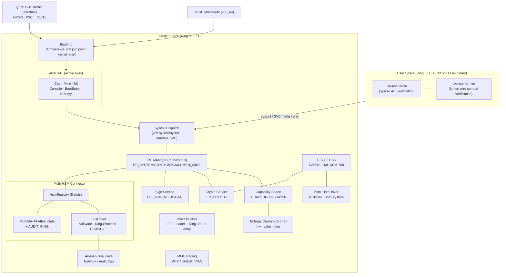
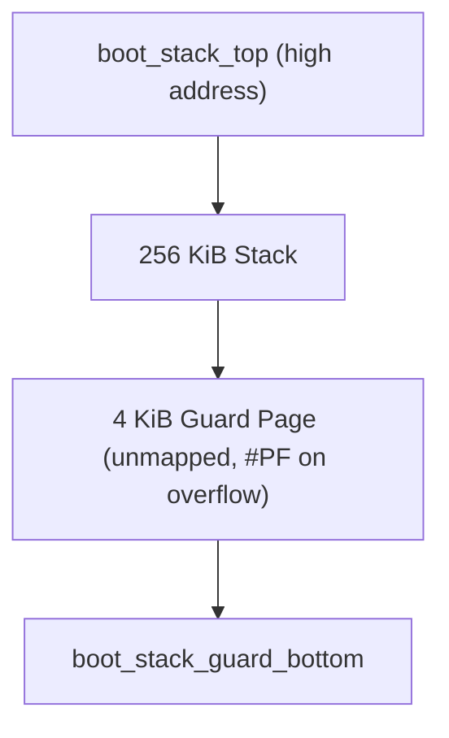
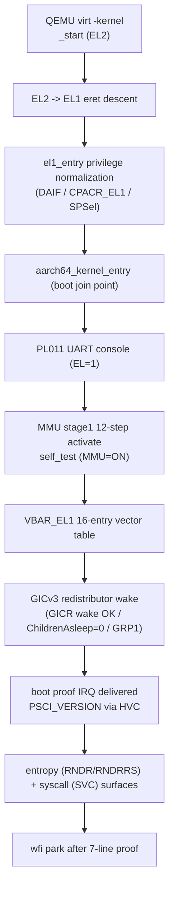

# Introduction

[](INTRODUCTION.md)
[](https://discord.gg/9utg4hp3m8)

ISO-LIGHT-K0 is an **ultra-lightweight `no_std` security microkernel** targeting high-security edge gateways, avionics and defense embedded terminals, and air-gapped data diodes. It guarantees memory safety via Rust's ownership system, supports both the x86_64 and aarch64 architectures from a single codebase, and operates using only static allocation and the stack, with no dynamic allocation (`alloc`). Cryptographic primitives use only the crates from [`elib-k0-nt`](https://github.com/Quant-Off/elib-k0-nt).

The core goal of this milestone is the **Multi-HSM Connector**. Users can safely attach any trustworthy HSM (soft keystore, Ring 3 lumen, and USB/SPI/smartcard in the future) to the kernel, and the kernel mediates data relay between them with zero-trust, constant-time, and zero dynamic allocation. lumen does not enter the kernel; it is treated only as a client of the wire protocol that the kernel defines.

This microkernel targets high security. Every implementation follows a design that maximizes the principle of least privilege and isolation, with memory safety guaranteed by Rust's own ownership system.

## Key Features

**Multi-architecture (HAL)** - Supports x86_64 and aarch64 from a single codebase. Architecture-neutral contracts are enforced by 6 HAL traits (`Cpu` `Mmu` `Idt` `Console` `BootEntry` `Entropy`), and the active target is exposed through the `arch::active` alias. x86_64 boots via a GRUB Multiboot2 ISO, aarch64 boots directly through QEMU virt `-kernel` (GICv3, PSCI over HVC, PL011 UART, MMU stage1), and a firmware-neutral `BootInfo` structure converges Multiboot2/UEFI/DTB handoffs into a single join point (`_kernel_start`).

**Zero-Trust isolation** - Rust-based memory safety minimizes `unsafe` and relies solely on static allocation. **Capability-based Access Control** makes IPC endpoints unreachable without an unforgeable token; **W^X** blocks execution of writable pages at the MMU level, and **Higher-Half** separates kernel and user space. x86_64's `CR0.WP` + `CR4.SMEP/SMAP/UMIP` and aarch64's PAN doubly control the user-memory access window, and guard-page-based stack protection immediately detects IST and boot stack overflows. Secure memory zeroing is guaranteed via volatile writes by the zeroize crate from `elib-k0-nt`, and every token/MAC comparison blocks side-channel attacks via the `constant-time` crate.

**Kernel-embedded cryptographic services** - Provides a **Crypto Service** (EP_CRYPTO: AES-256-GCM, ChaCha20-Poly1305, BLAKE3, SHA-2/3, HKDF, Ed25519/Ed448, X448 DH), a **PQ Sign Service** (EP_SIGN: ML-DSA-44 chunk protocol), and a **TLS 1.3 PSK handshake** (Closed/External profiles, `psk_pq_hybrid_ke` = X25519 + ML-KEM-768).

**Multi-HSM Connector** - Attaches heterogeneous HSMs concurrently through an up-to-8-slot `HsmRegistry` and the `bus::BusDriver` abstract trait. An ML-DSA-44 attestation gate verifies the trust root at attach time; `SoftwareBus` (soft HSM) and `Ring3ProcessBus` (lumen wire) implementations relay data over the `LWK0` wire protocol, and a 32-entry AUDIT_RING records attach and relay events. Long-term secrets (PSK) are, separately, exposed through the `hsm::HsmDriver` abstract trait (NullHsm / SoftKeystore fallback) so that the TLS code path is reused across both HSM and soft backends.

**Air-Gapped Ready + entropy quorum** - External-network communication is permitted only after passing both the `tls-external` build feature and a runtime capability double gate; the default `closed` profile has zero attack surface because the network symbols are absent altogether, verified at boot by `gap_self_check`. Entropy is evaluated by NIST SP 800-90B health tests across 3 sources, hardware RNG (x86 RDRAND/RDSEED, aarch64 RNDR/RNDRRS), virtio-rng, and jitter, then combined under a production 2-of-3 quorum, and fail-closes on shortfall.

Additionally, the **SIMD/FPU context** (x86_64) is activated to support x87/SSE/AVX along with AES-NI and SHA-NI hardware acceleration.

## Architecture



## Modules

Each feature is separated into and managed as an individual module as follows.

**Boot / firmware-neutral layer**

- `main.rs`: Kernel entry point, module wiring, architecture-neutral `_kernel_start` join point
- `boot/mod.rs`: Firmware-neutral `BootInfo` (converges Multiboot2 / UEFI / DTB handoffs into a single structure)
- `boot/memory_map.rs`: Physical memory map (+ KASLR custom tag)
- `boot/uefi.rs`: UEFI handoff surface (Phase 11 stub)
- `panic.rs`: Immediate-halt panic handler with no information leak
- `stack.rs`: IST and boot stack layout, and guard page canary management

**arch HAL** (`arch/mod.rs`: 6 trait definitions + `active` alias cfg wiring)

- `arch/common/`: architecture-neutral `syscall` (`SyscallNum` call catalog) + `entropy` subtree
- `arch/x86_64/`: `boot_stub` (Multiboot2 header + 32->64 transition + 256 KiB boot stack), `multiboot2`, `kernel_start`, `cpu` (SIMD/FPU + SMEP/SMAP/UMIP), `gdt` / `idt` / `tss`, `mmu` (4-level paging + W^X + KASLR), `vga`, `syscall`, `process_entry`, `entropy` (RDRAND/RDSEED + virtio)
- `arch/aarch64/`: `boot_stub` (EL2->EL1 eret descent), `boot` (boot join point), `cpu` (DAIF/CPACR_EL1/PAN), `vectors` (16-entry + VBAR_EL1), `mmu` (stage1 + 48-bit VA + TTBR split), `gic` (GICv3 redistributor wake), `psci` (PSCI over HVC), `console` (PL011 UART), `syscall` (SVC), `process_entry` (EL0 descent), `entropy` (RNDR/RNDRRS)

**Memory**

- `allocator.rs`: Bitmap-based physical frame allocator, `zeroize::secure_zero` on free

**Capability / IPC / user space**

- `capability.rs`: Capability-based Access Control implementation + Hash-DRBG-SHA-256 (RDSEED/RDRAND seed)
- `ipc.rs`: Synchronous message passing (rendezvous), registers `EP_SYSTEM`/`EP_CRYPTO`/`EP_SIGN`/`EP_LUMEN_WIRE`
- `process.rs`: Static process slots, user PML4 + ELF PT_LOAD mapping, Ring 3 entry (`cr3` + `swapgs` + `iretq`)
- `elf.rs`: Static ELF64 (`ET_EXEC`/`ET_DYN` + `EM_X86_64`) parser, PT_LOAD validation

**Kernel-embedded services**

- `crypto_service.rs`: `EP_CRYPTO` dispatcher: AES-256-GCM, ChaCha20-Poly1305, BLAKE3, SHA-2/3, HMAC-SHA-256, HKDF, Ed25519/Ed448 sign/verify, X448 DH
- `sign_service.rs`: `EP_SIGN` ML-DSA-44 chunk protocol (Begin -> InChunk -> Exec -> OutChunk -> End)
- `hsm.rs`: PSK-access HSM abstract trait `HsmDriver`, `PskId`, `NullHsm` (fallback when no HSM is supplied)
- `keystore.rs`: Static-pool PSK Soft Keystore, `Provisioned` -> `Wiped` one-way lifecycle
- `tls/` (mod, handshake, keyschedule, record, transcript): TLS 1.3 PSK (`psk_dhe_ke` / `psk_pq_hybrid_ke`), Closed/External profiles, AEAD records, HKDF-Expand-Label, SHA-256 transcript

**Multi-HSM Connector**

- `hsm_registry.rs`: 8-slot `HsmRegistry`, `HsmCapability` (16 bytes), attach/detach/enumerate/write/relay/read handlers
- `bus.rs`: `BusDriver` abstract trait + `SoftwareBus` (64B loopback) / `Ring3ProcessBus` (lumen wire) + `LWK0` wire protocol (`WireFrameHeader` 16B, `WireCmd`, `WireStatus`)
- `hsm_attest.rs`: ML-DSA-44 attestation verifier (`verify_attest`) + trust-root dual-path (`init_trust_root`) + 32-entry `AUDIT_RING`
- `air_gap.rs`: External-network double gate (`NETWORK_ATTACH_CAP`) + audit query (`AUDIT_READ_CAP`, `sys_hsm_status` 456 octets) + `gap_self_check` boot-time fail-stop
- `arch/common/entropy/`: `quorum` (2-of-3 policy) + `health` (SP 800-90B StreamHealth) + `jitter` + `virtio_rng`

**Embedded user crates**

- `crates/iso-user-hello/`: Ring 3 entry + verification of `sys_write` / `sys_getrandom` / `sys_exit` behavior
- `crates/iso-user-lumen/`: Demonstrates the [lumen](https://github.com/Quant-Off/lumen) project's `elib-k0-nt` wire compatibility (BLAKE3 / BLAKE3-keyed / Ed25519 determinism / X25519 ECDH / AES-256-GCM) from Ring 3
- `build.rs`: Copies user ELFs to `OUT_DIR` -> exposes environment variables `ISO_USER_HELLO_ELF` / `ISO_USER_LUMEN_ELF` -> `include_bytes!` embed (graceful degrade to a 4-byte placeholder when not built)

## Security

### Capability-based Access Control

A `Capability` consists of a $64$-bit PRNG token, Endpoint ID, and Rights. IPC endpoint access is impossible without the token, and partial delegation is only possible with **GRANT** rights (attenuation principle). On scope exit, the token is immediately zeroed via `Secret<T>`.


### Zeroize

Secure memory zeroing is performed using the zeroize crate from the external `elib-k0-nt`. `volatile::secure_zero()` provides memory zeroing with compiler optimization barriers, `Secret<T>` provides a sensitive-data wrapper that is automatically zeroed on scope exit, and `compiler_fence(SeqCst)` is used as a memory ordering barrier.

### W^X Policy

Writable (`WRITABLE`) pages are automatically set as non-executable (`NO_EXECUTE`). Code injection attacks are fundamentally blocked, enforced at the MMU entry configuration level (common to x86_64 4-level paging / aarch64 stage1).

### HSM Abstraction + Soft Keystore Fallback

All access to long-term secrets (PSK) is exposed through the `hsm::HsmDriver` trait. In an HSM environment the HMAC computation is performed inside the HSM engine so the PSK is never exposed in memory, and in air-gapped environments with no HSM, `keystore::SoftKeystore` provides a static-pool-based fallback. PSK slots operate on an `Empty -> Provisioned -> Wiped` one-way lifecycle to block identifier-reuse attacks. The `psk_exists()` check is performed in `constant-time`, and key material is protected by `Secret<[u8; MAX_PSK_LEN]>`.

| Implementation | Use case                                                      |
|----------------|---------------------------------------------------------------|
| `NullHsm`      | No HSM/PSK supplied: TLS handshake immediately fail-stops at boot |
| `SoftKeystore` | Air-gapped pre-distributed PSK: register via `provision()`, wipe all slots immediately via `wipe_all()` |
| (HSM driver)   | Reuse the same TLS code path by only implementing `HsmDriver` |

> [!NOTE]
> `hsm::HsmDriver` is a TLS-PSK/HMAC-only abstraction. The connector layer that attaches heterogeneous HSMs to the kernel is handled by `bus::BusDriver` + `HsmRegistry`, covered in the [Multi-HSM Connector](#multi-hsm-connector) section below.

### SIMD/FPU Context

`arch/x86_64/cpu.rs` activates the x87/SSE/AVX context so that `elib-k0-nt`'s cryptographic primitives can use SIMD instructions.

| Register | Configuration                                                                 |
|----------|-------------------------------------------------------------------------------|
| `CR0`    | $`\texttt{EM}=0,\ \texttt{TS}=0,\ \texttt{MP}=1,\ \texttt{NE}=1`$             |
| `CR4`    | $`\texttt{OSFXSR}=1,\ \texttt{OSXMMEXCPT}=1,\ \texttt{OSXSAVE}=1`$ (if AVX supported) |
| `XCR0`   | Enable x87 + SSE + AVX state components                                       |

Hardware features detected via CPUID include SSE/SSE2/SSE3/SSSE3/SSE4.1/SSE4.2, AVX/AVX2, **AES-NI** (hardware AES acceleration), **SHA-NI** (hardware SHA acceleration), `RDRAND`/`RDSEED` (hardware random number generation), and `XSAVE` (extended state saving).

## Stack Protection

Stack protection is described for x86_64. aarch64 provides equivalent isolation through the `SPSel #1` dedicated panic stack and 16-entry vector table in `vectors.rs`.

### Boot Stack

The boot stack has been extended to $256\ \text{KiB}$, with a $4\ \text{KiB}$ guard page placed at the bottom. After MMU activation, the guard region is unmapped, causing an immediate `#PF` on overflow.



### IST (Interrupt Stack Table)

Dedicated stacks for fatal exceptions are independently isolated so that handlers execute in a safe context even when the kernel main stack is corrupted.

| IST    | Exception                     | Stack                                  |
|--------|-------------------------------|----------------------------------------|
| `IST1` | `#DF` Double Fault            | $64\ \text{KiB} + 4\ \text{KiB}$ Guard |
| `IST2` | `#NMI` Non-Maskable Interrupt | $32\ \text{KiB} + 4\ \text{KiB}$ Guard |
| `IST3` | `#MC` Machine Check           | $32\ \text{KiB} + 4\ \text{KiB}$ Guard |
| `IST4` | `#PF` Page Fault              | $64\ \text{KiB} + 4\ \text{KiB}$ Guard |

Before MMU activation, software verification is performed using the canary pattern (`0xDEADBEEFCAFEF00D`).

## Memory Layout

The x86_64 virtual address space follows the 48-bit canonical model. aarch64 mirrors this with stage1 48-bit VA under a `TTBR0_EL1` (user) / `TTBR1_EL1` (kernel) split.

| Address                 | Region            | Description                                                   |
|-------------------------|-------------------|---------------------------------------------------------------|
| `0xFFFF_FFFF_8000_0000` | `KERNEL_VMA_BASE` | Higher-Half (`.text` R+X, `.rodata` R, `.data` RW, `.bss` RW) |
| `0xFFFF_8000_0000_0000` | `PHYS_MAP_OFFSET` | Direct Linear Map ($2\ \text{MiB}$ huge pages)                |
| `0x0000_0000_0010_0000` | `PHYS_LOAD_BASE`  | GRUB load address ($1\ \text{MiB}$)                           |
| `0x0000_0000_0000_0000` | Reserved          | BIOS, VGA, IVT                                                |

## Boot Sequence

### x86_64

```mermaid
flowchart TB
    A["GRUB (Multiboot2)"] --> B["_start (32-bit, 0x100000)"]
    B --> C["Page table setup<br/>(Identity Map + Higher-Half)"]
    C --> D["Long Mode entry"]
    D --> E["_start64"]
    E --> F["Far Jump"]
    F --> G["BootInfo convergence -> _kernel_start (64-bit)"]
    G --> H["VGA initialization"]
    H --> I["SIMD/FPU context activation"]
    I --> J["Install IST stack guard canaries"]
    J --> K["TSS, GDT, IDT initialization"]
    K --> L["SIMD/FPU final verification"]
    L --> M["Memory Map parsing<br/>Physical frame allocator initialization"]
    M --> N["MMU typestate initialization (KASLR offset)"]
    N --> O["Build direct linear mapping (2 MiB pages)"]
    O --> P["Kernel segment W^X mapping<br/>(excluding IST guard pages)"]
    P --> P1["Enable CR0.WP + CR4.SMEP/SMAP/UMIP + EFER.SCE"]
    P1 --> P2["TSS.RSP0 + syscall infra (STAR/LSTAR/SFMASK + KernelGsBase)"]
    P2 --> P3["Capability DRBG initialization<br/>(Hash-DRBG-SHA256, entropy quorum seed)"]
    P3 --> Q["IPC subsystem initialization<br/>(EP_SYSTEM, EP_CRYPTO, EP_SIGN, EP_LUMEN_WIRE)"]
    Q --> Q1["crypto_smoke_test (debug)<br/>EP_CRYPTO BLAKE3 round-trip"]
    Q1 --> Q2["tls_smoke_test (debug)<br/>PSK PQ-Hybrid + Classical handshake"]
    Q2 --> R["Enable interrupts (sti)"]
    R --> S["Spawn embedded user ELF (debug)<br/>iso-user-lumen first, iso-user-hello fallback"]
    S --> T["enter_ring3 (cr3 + swapgs + iretq) -> Ring 3"]
    T --> U["Handle user syscalls / cli+hlt on sys_exit"]
```



### aarch64

Boots directly via `-kernel` on QEMU virt, and demonstrates the boot order at runtime with a 7-line proof of markers (`qemu-smoke-aarch64`). The current milestone parks with `wfi` after the proof; EL0 user entry is deferred to Phase 11.



## Ring 3 User Processes

`iso-light-k0` embeds static ELF64 user programs and runs them in Ring 3 (x86_64). aarch64 EL0 user entry is prepared via the `BootEntry::enter_user` surface, but user ELF spawning is deferred to Phase 11.

| User crate              | Purpose                                                                                       |
|-------------------------|-----------------------------------------------------------------------------------------------|
| `crates/iso-user-hello` | Ring 3 entry + verification of `sys_write` / `sys_getrandom` / `sys_exit` behavior            |
| `crates/iso-user-lumen` | Demonstrates the `lumen` project's `elib-k0-nt` wire compatibility (BLAKE3 / Ed25519 / X25519 / AES-256-GCM) from Ring 3 |

The build has two stages:

```bash
make userspace         # Build the two user ELFs (iso-user-hello, iso-user-lumen)
make build             # Build kernel: build.rs embeds the user ELFs via include_bytes!
make iso && make run   # QEMU boot (debug build, VGA window shown)
```

A missing user crate for the `userspace` target is automatically skipped, and an unbuilt user ELF is replaced by `build.rs` with a 4-byte placeholder. This placeholder is rejected by `elf::parse()` as `BadMagic`/`Truncated`, so the spawn attempt safely fail-stops (the kernel build itself always passes). At boot it tries `iso-user-lumen` -> `iso-user-hello` in order; if both are placeholders it enters the kernel main loop (`kernel_main_loop`).

### Four-fold Security Isolation Boundary

| Bit | Effect |
|------|------|
| `CR4.SMEP` | Blocks the kernel from executing code on user pages |
| `CR4.SMAP` | Blocks direct kernel <-> user memory access (only the stac/clac window is allowed) |
| `IA32_FMASK` | Immediately zeroes the user RFLAGS IF/TF/AC/DF/NT/IOPL on syscall entry |
| `CR4.UMIP` | Blocks SGDT/SIDT/STR/SLDT/SMSW in Ring 3 |

### Syscall ABI

The call catalog is defined in `SyscallNum` in the architecture-neutral `arch/common/syscall.rs`; x86_64 enters via `syscall/sysret`, aarch64 via `SVC #0`.

| No. | Name              | Role                                          | Status                       |
|----|-------------------|-----------------------------------------------|------------------------------|
| 0  | `Exit`            | Process exit                                  | Implemented                  |
| 1  | `Write`           | `fd=2` (stderr) output                        | Implemented                  |
| 2  | `IpcCall`         | User -> kernel synchronous IPC call           | Defined, dispatch unwired (Phase B) |
| 3  | `IpcRecv`         | Service-side receive                          | Defined, dispatch unwired (Phase B) |
| 4  | `IpcReply`        | Service-side reply post                       | Defined, dispatch unwired (Phase B) |
| 5  | `GetRandom`       | Kernel DRBG output                            | Implemented                  |
| 6  | `CapRequest`      | Issue Capability after policy validation      | Defined, dispatch unwired (Phase B) |
| 7  | `HsmAttach`       | Attach HSM slot (ML-DSA-44 attest gate + air-gap branch) | Implemented       |
| 8  | `HsmDetach`       | Detach slot + zeroize (post-attach CAP check) | Implemented                  |
| 9  | `HsmEnumerate`    | Enumerate attached slots (post-attach CAP check) | Implemented               |
| 10 | `HsmWrite`        | USE cap -> SoftHSM mode-aware write           | Implemented                  |
| 11 | `HsmRelay`        | src/dst dual-cap kernel-internal relay        | Implemented                  |
| 12 | `HsmRead`         | USE cap -> retrieve wire frame response       | Implemented                  |
| 13 | `AttestFixtureExport` | Export attest fixture (test)              | `smoke` feature only         |
| 14 | `NetworkCapTake`  | Take external-network attach capability       | `tls-external` feature only  |
| 15 | `AuditCapTake`    | Take audit-read capability                    | Implemented                  |
| 16 | `HsmStatus`       | Atomic query of air-gap state + audit, 456 octets | Implemented              |

Calling convention (x86_64): number = `RAX`, arguments = `RDI/RSI/RDX/R10/R8/R9`, return = `RAX` (negative = `SyscallError`). `RCX/R11` are saved automatically by the CPU. User <-> kernel memory transfers are performed only within the SMAP `stac/clac` window, with length/address always validated. The entry stub switches RSP to the per-CPU `kernel_stack_top` (gs:0x00) immediately after `swapgs`.

## IPC Endpoints

| ID       | Name           | Required Rights | Description                                                |
|----------|----------------|-----------------|------------------------------------------------------------|
| `0x0000` | `EP_SYSTEM`    | `CALL`          | Kernel system service                                      |
| `0x0001` | `EP_CRYPTO`    | `CALL`          | Cryptographic service, handled synchronously by `crypto_service::dispatch()` |
| `0x0002` | `EP_SIGN`      | `CALL`          | ML-DSA-44 PQ signature service, chunk protocol handled by `sign_service::dispatch()` |
| `0x0003` | `EP_LUMEN_WIRE`| `CALL`          | Ring 3 lumen wire endpoint (`Ring3ProcessBus` binding)     |

Internal service endpoints are dispatched synchronously on the same call stack immediately after message posting inside `ipc_call` (guaranteeing a round-trip before a scheduler is introduced).

## Crypto Service (EP_CRYPTO)

`crypto_service.rs` handles the following algorithms as a single IPC dispatcher. Request/response payloads reuse a 256-byte `CryptoPayload` layout, and all plaintext/key material is protected by `Secret<T>` and automatically zeroed on scope exit.

| Message Type                | Algorithm                                                |
|-----------------------------|----------------------------------------------------------|
| `EncryptReq` / `DecryptReq` | `Aes256Gcm`, `ChaCha20Poly`                              |
| `HashReq`                   | `Blake3`, `Sha3_256`, `Sha3_512`                         |
| `KeyDeriveReq`              | `HkdfSha256` (RFC 5869)                                  |
| `SignReq` / `VerifyReq`     | `Ed25519Sign`/`Ed25519Verify`, `Ed448Sign`/`Ed448Verify` |
| `DhReq`                     | `X448Dh`                                                 |

## Sign Service (EP_SIGN)

`sign_service.rs` handles ML-DSA-44 (Dilithium2) with a 5-stage chunk protocol to solve the problem that its key material/signature sizes exceed the 256-byte IPC payload limit.

```
Begin -> InChunk* -> Exec -> OutChunk* -> End
```

Supported operations: `Keygen`, `Sign`, `Verify`. The session state (`SignSession`) is a single static slot, and rejects out-of-order calls via `phase` / `op` validation.

## Multi-HSM Connector

This is the core layer of the milestone. Users attach heterogeneous HSMs to kernel slots, and the kernel relays data between slots with zero-trust. Unlike `hsm::HsmDriver`, which is TLS-PSK-only, the connector consists of `bus::BusDriver` + `HsmRegistry`.

### Registry and Bus

`HsmRegistry` holds up to 8 slots in static BSS, and each slot is bound to one `BusDriver` instance (`BusInstance` enum-dispatch). On attach, an unforgeable `HsmCapability` (16 bytes) is issued, and subsequent write/relay/read are rejected without this capability.

| `BusKind`      | Value | Status                                 |
|----------------|-------|----------------------------------------|
| `Software`     | 0 | In-kernel soft HSM (`SoftwareBus`, Echo/Blake3/AesGcm) |
| `Ring3Process` | 1 | Ring 3 lumen wire (`Ring3ProcessBus`)  |
| `Usb` / `Spi` / `Serial` / `SmartCard` | 2-5 | Future hardware buses (surface reserved) |
| `Network`      | 6 | External network (`tls-external` + air-gap double gate) |

### Wire Protocol

`Ring3ProcessBus` composes frames with the `LWK0` magic + a 16-byte `WireFrameHeader`.

| Item           | Value                                                     |
|----------------|----------------------------------------------------------|
| `WIRE_MAGIC`   | `b"LWK0"`                                                 |
| `WIRE_VERSION` | `0x0001`                                                  |
| Max frame      | `WIRE_FRAME_MAX = 4096` (payload = 4080)                  |
| Command        | `WireCmd` (request/response bit `0x8000`), status `WireStatus` |

### Attestation Gate

`HsmAttach` verifies the attach target's ML-DSA-44 signature via `hsm_attest::verify_attest`. Any verification failure (signature/public-key/version mismatch) collapses into a single `AttestError::AttestFailed` and is rejected with no information leak. The trust-root public key is loaded once at boot by `init_trust_root` (keystore slot 0xFE raw PK first, falling back to `HSM_TRUST_ROOT_PK_CONST` if absent), with no runtime rotation path. All attach/relay/reject events are recorded in the 32-entry `AUDIT_RING` (oldest-overwrite).

## Air-Gap Double Gate

Attaching to the external network (`BusKind::Network`) is permitted only after passing both gates.

- **Build gate**: In the `closed` profile with the `tls-external` feature disabled, the network symbols (`NETWORK_SYM_PRESENT = false`) are absent, giving zero attack surface.
- **Runtime gate**: Only a caller that has taken `NETWORK_ATTACH_CAP` (one-shot, `Provisioned -> Taken` one-way FSM) via `NetworkCapTake` can attach a Network slot.

At boot, if `gap_self_check` detects an uninitialized capability, it immediately fail-stops with `panic = abort`. Audit queries are gated by the `AUDIT_READ_CAP` common to both profiles, and `HsmStatus` (`sys_hsm_status`) atomically returns header 8 + slots 64 + audit 384 = **456 octets**.

## Entropy Quorum

Boot/reseed entropy is combined from 3 sources and supplied only through a single entry point (`QuorumEntropy::collect` / `collect_with_retry`).

| Source    | x86_64                | aarch64        |
|-----------|-----------------------|----------------|
| `hw`      | RDRAND / RDSEED       | RNDR / RNDRRS  |
| `virtio`  | virtio-rng (PCI/MMIO) | virtio-rng     |
| `jitter`  | CPU jitter            | CPU jitter     |

Each source is evaluated with a NIST SP 800-90B `StreamHealth`, and production builds enforce a strict **2-of-3** quorum (`entropy-degraded-ok` builds use 1-of-3). On shortfall, the boot path immediately fail-closes with `Err(QuorumFailed)`, and the runtime path panics directly when the reseed window is exceeded. The 3-source combination is performed only with the `blake::Blake3` XOF, introducing no new cryptographic algorithm. `entropy-degraded-ok` and `tls-external` are blocked from being simultaneously active by a compile-time mutex.

## TLS 1.3 PSK

The `tls/` module implements a reduced form of the [RFC 8446](https://datatracker.ietf.org/doc/rfc8446/) PSK handshake tailored to an air-gapped pre-distributed PSK model.

| Item         | Value                                                                                    |
|--------------|-----------------------------------------------------------------------------------------|
| Profile      | `Closed` (default `psk_pq_hybrid_ke` enforced) · `External` (requires the `tls-external` build feature) |
| KEX Policy   | `Hybrid` = X25519 (32B) ‖ ML-KEM-768 (32B) -> 64B `ecdhe_ss` · `Classical` = X25519 only |
| Cipher Suite | `Aes256GcmSha256`, `ChaCha20Poly1305Sha256`                                             |
| Key material protection | All traffic secrets / keys / ivs are `Secret<T>`, volatile-written on Drop      |
| Handshake auth | PSK binder MAC (HMAC-SHA-256) compared in `constant-time`                              |
| Transcript   | SHA-256 accumulation, `Secret` protected                                                 |
| Key schedule | RFC 8446 Section 7.1 `early/handshake/master` + `client/server traffic` stage separation |

The boot-stage `tls_smoke_test()` (debug build) verifies the handshake + AEAD round-trip for the two policies `psk_pq_hybrid_ke` -> `Classical` via an in-kernel loopback, then `wipe_all`s the keystore and connection pool.

## elib-k0-nt Integration

Leverages `elib-k0-nt`'s cryptographic primitives; with the SIMD/FPU context active, hardware acceleration is available.

| Crate           | Description                                          |
|-----------------|------------------------------------------------------|
| `zeroize`       | Secure memory zeroing, `Secret<T>` wrapper, `volatile::secure_zero` |
| `constant-time` | `Choice` type, constant-time byte/token comparison (Capability/MAC/PSK validation) |
| `aes`           | AES-128/192/256, AES-GCM (AES-NI accelerated)        |
| `chacha20`      | ChaCha20-Poly1305 AEAD                               |
| `sha2`          | SHA-256, SHA-384, SHA-512                            |
| `sha3`          | SHA3, SHAKE128/256                                   |
| `blake`         | BLAKE3 (plain / keyed / XOF)                         |
| `rng`           | Hash DRBG (NIST SP 800-90A Rev.1, SHA-256 instance)  |
| `ed25519`       | Ed25519 signature (RFC 8032 determinism)             |
| `ed448`         | Ed448 signature                                      |
| `x25519`        | X25519 key exchange                                  |
| `x448`          | X448 key exchange                                    |
| `mldsa`         | ML-DSA (Dilithium) post-quantum signature: `EP_SIGN` + attest gate |
| `mlkem`         | ML-KEM (Kyber) post-quantum key encapsulation: TLS PSK Hybrid KEX |

## Roadmap

**Implemented**:

- Multi-architecture HAL (x86_64 + aarch64, 6 traits `Cpu`/`Mmu`/`Idt`/`Console`/`BootEntry`/`Entropy`, `active` alias)
- aarch64 bare-metal boot (EL2->EL1 descent, GICv3, PSCI over HVC, PL011 UART, MMU stage1, 7-line proof `qemu-smoke-aarch64`)
- Multi-HSM Connector (8-slot `HsmRegistry`, `bus::BusDriver`, `LWK0` wire protocol, ML-DSA-44 attestation, 32-entry AUDIT_RING)
- Air-gap double gate (`tls-external` + capability) + audit query syscall (`HsmStatus` 456 octets)
- Entropy quorum (2-of-3, NIST SP 800-90B health test, virtio-rng / hw / jitter)
- Ring 3 user space loader + embedded user ELFs (`iso-user-hello`, `iso-user-lumen`)
- TLS 1.3 PSK handshake (`psk_dhe_ke` / `psk_pq_hybrid_ke`, Closed/External profiles)
- ML-DSA-44 PQ signature service (`EP_SIGN` chunk protocol)
- PSK HSM driver abstraction (`hsm::HsmDriver` + `NullHsm` + `keystore::SoftKeystore` fallback)

**Future plans**:

- Multi-user process scheduler (`IpcCall`/`IpcRecv`/`IpcReply`/`CapRequest` dispatch wire-up, Phase B)
- Real HSM bus drivers (`Usb` / `Spi` / `SmartCard` `BusKind` actuation)
- aarch64 EL0 user ELF loader (currently `EM_X86_64` only, only the `enter_user` surface is prepared)
- Actual UEFI boot path (currently the `boot/uefi.rs` surface stub) + DTB parsing
- KPTI-style PML4 separation for stronger module isolation, TUI framebuffer rendering engine

> [!NOTE]
> Coupling verification with the lumen project is performed through the wire-compatibility checks of `iso-user-lumen` (BLAKE3 / BLAKE3-keyed / Ed25519 determinism / X25519 ECDH / AES-256-GCM). It does not depend on `lumen` itself; it directly calls the *same* `elib-k0-nt` modules that lumen's `lumen-channel` / `lumen-core` / `lumen-capability` use, demonstrating identical input -> identical bit output (see the wire-compatibility table in `lumen/KERNEL-COMPAT.md Section 3`).
