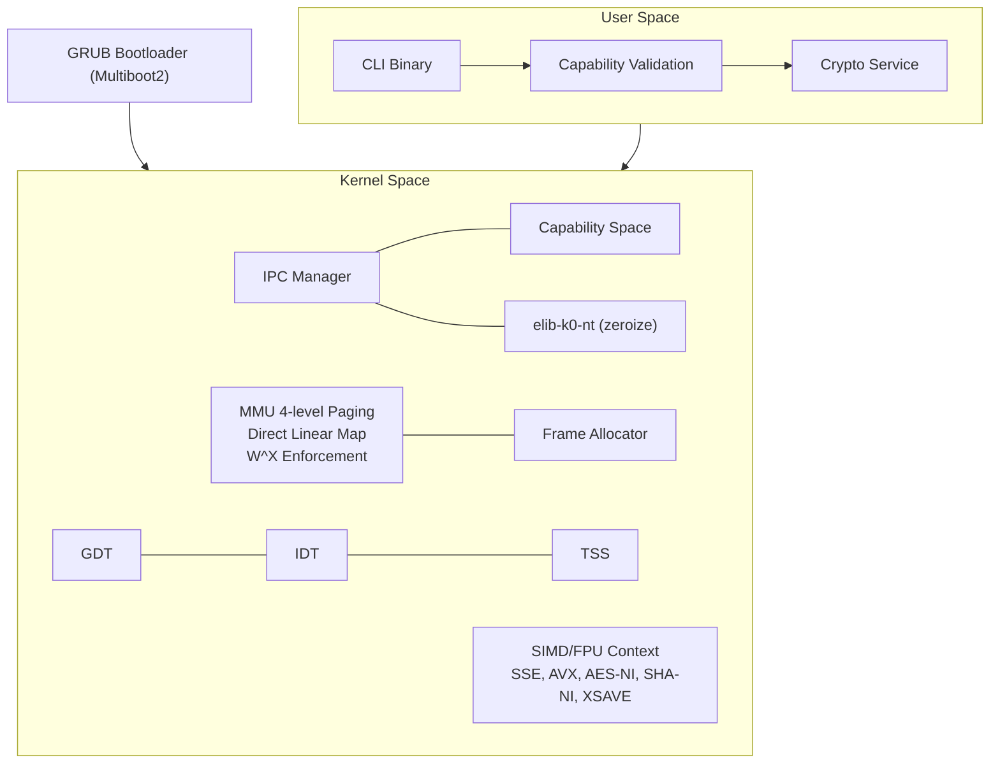
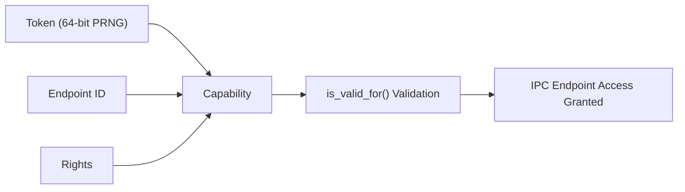
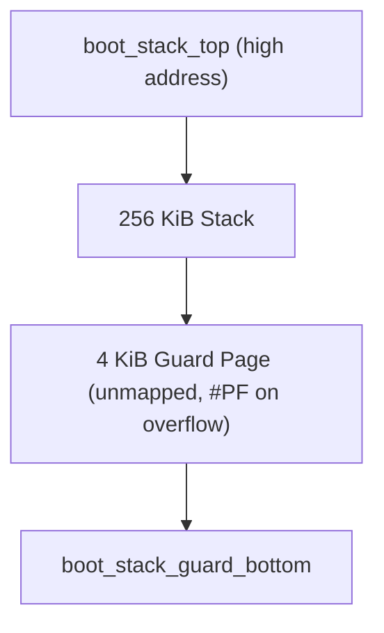
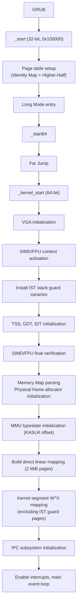

# Introduction

`iso-light-k0` is an **ultra-lightweight security microkernel** targeting diverse architectures and bare-metal environments. It guarantees memory safety in Rust `no_std` and enforces the principle of least privilege through **Capability-based Access Control** and **synchronous IPC**. Cryptographic primitives leverage crates from [`elib-k0-nt`](https://github.com/Quant-Off/elib-k0-nt).

This microkernel targets high security. Every implementation follows a design that maximizes the principle of least privilege and isolation, with memory safety guaranteed by Rust's ownership system.

## Key Features

Rust-based memory safety minimizes `unsafe` usage and relies solely on static allocation without `alloc`. **Capability-based Access Control** enforces unforgeable token-based resource access, and synchronous IPC via the **Rendezvous Model** implements message-passing-based inter-process communication. **W^X** blocks execution of writable pages at the MMU level, and **Higher-Half** fully separates kernel and user space. Secure memory zeroing is guaranteed by the zeroize crate from `elib-k0-nt` via volatile writes.

Additionally, the **SIMD/FPU context** is activated to support x87/SSE/AVX along with AES-NI and SHA-NI hardware acceleration, and **guard-page-based stack protection** immediately detects IST and boot stack overflows.

## Architecture

## Modules

Each feature is managed as a separate module as follows.

- `main.rs`: Kernel entry point and boot sequence
- `boot.rs`: GDT initialization and segment configuration
- `boot_stub.rs`: Multiboot2 header, 32-bit to 64-bit transition, and 256 KiB boot stack handling
- `mmu.rs`: 4-level page tables, KASLR, W^X policy
- `capability.rs`: Capability-based Access Control implementation
- `ipc.rs`: Synchronous message passing (rendezvous)
- `idt.rs`: Interrupt Descriptor Table and IST index configuration
- `tss.rs`: Task State Segment and IST stacks (with guard pages)
- `stack.rs`: IST stack layout and guard page canary management
- `cpu.rs`: SIMD/FPU context activation and CPUID feature detection
- `allocator.rs`: Bitmap-based physical frame allocator
- `vga.rs`: VGA text mode output

## Security

### Capability-based Access Control

A `Capability` consists of a $64$-bit PRNG token, Endpoint ID, and Rights. IPC endpoint access is impossible without a token, and partial delegation is only possible with **GRANT** rights (attenuation principle). On scope exit, the token is immediately zeroed via `Secret<T>`.

### Zeroize

Secure memory zeroing is performed using the zeroize crate from the external `elib-k0-nt`. `volatile::secure_zero()` provides memory zeroing with compiler optimization barriers, `Secret<T>` provides a sensitive data wrapper that is automatically zeroed on scope exit, and `compiler_fence(SeqCst)` is used as a memory ordering barrier.

### W^X Policy

Writable (`WRITABLE`) pages are automatically set as non-executable (`NO_EXECUTE`). Code injection attacks are fundamentally blocked, enforced at the MMU entry configuration level.

### SIMD/FPU Context

`cpu.rs` activates the x87/SSE/AVX context to enable `elib-k0-nt`'s cryptographic primitives to use SIMD instructions.

| Register | Configuration                                                                 |
|----------|-------------------------------------------------------------------------------|
| `CR0`    | $`\texttt{EM}=0,\ \texttt{TS}=0,\ \texttt{MP}=1,\ \texttt{NE}=1`$             |
| `CR4`    | $`\texttt{OSFXSR}=1,\ \texttt{OSXMMEXCPT}=1,\ \texttt{OSXSAVE}=1`$ (if AVX supported) |
| `XCR0`   | Enable x87 + SSE + AVX state components                                       |

Hardware features detected via CPUID include SSE/SSE2/SSE3/SSSE3/SSE4.1/SSE4.2, AVX/AVX2, **AES-NI** (hardware AES acceleration), **SHA-NI** (hardware SHA acceleration), `RDRAND`/`RDSEED` (hardware random number generation), and `XSAVE` (extended state saving).

## Stack Protection

### Boot Stack

The boot stack has been extended to $256\ \text{KiB}$, with a $4\ \text{KiB}$ guard page placed at the bottom. After MMU activation, the guard region is unmapped, causing an immediate `#PF` on overflow.

### IST (Interrupt Stack Table)

Dedicated stacks for fatal exceptions are independently isolated so that handlers execute in a safe context even when the kernel main stack is corrupted.

| IST    | Exception                     | Stack                                  |
|--------|-------------------------------|----------------------------------------|
| `IST1` | `#DF` Double Fault            | $64\ \text{KiB} + 4\ \text{KiB}$ Guard |
| `IST2` | `#NMI` Non-Maskable Interrupt | $32\ \text{KiB} + 4\ \text{KiB}$ Guard |
| `IST3` | `#MC` Machine Check           | $32\ \text{KiB} + 4\ \text{KiB}$ Guard |
| `IST4` | `#PF` Page Fault              | $64\ \text{KiB} + 4\ \text{KiB}$ Guard |

Before MMU activation, software verification is performed using the canary pattern (`0xDEADBEEFCAFEF00D`).

## Memory Layout

The virtual address space follows the 48-bit canonical model.

| Address                 | Region            | Description                                                   |
|-------------------------|-------------------|---------------------------------------------------------------|
| `0xFFFF_FFFF_8000_0000` | `KERNEL_VMA_BASE` | Higher-Half (`.text` R+X, `.rodata` R, `.data` RW, `.bss` RW) |
| `0xFFFF_8000_0000_0000` | `PHYS_MAP_OFFSET` | Direct Linear Map ($2\ \text{MiB}$ huge pages)                |
| `0x0000_0000_0010_0000` | `PHYS_LOAD_BASE`  | GRUB load address ($1\ \text{MiB}$)                           |
| `0x0000_0000_0000_0000` | Reserved          | BIOS, VGA, IVT                                                |

## Boot Sequence

## IPC Endpoints

| ID       | Name        | Description          |
|----------|-------------|----------------------|
| `0x0000` | `EP_SYSTEM` | Kernel system call   |
| `0x0001` | `EP_CRYPTO` | Cryptographic service |

## elib-k0-nt Integration

Leverages cryptographic primitives from `elib-k0-nt`; with SIMD/FPU context active, hardware acceleration is available.

| Crate      | Description                                  |
|------------|----------------------------------------------|
| `zeroize`  | Secure memory zeroing, `Secret<T>` wrapper   |
| `aes`      | AES-128/192/256, AES-GCM (AES-NI accelerated) |
| `chacha20` | ChaCha20-Poly1305 AEAD                       |
| `sha2`     | SHA-256, SHA-384, SHA-512                    |
| `sha3`     | SHA3, SHAKE128/256                           |
| `blake`    | BLAKE3                                       |
| `rng`      | Hash DRBG                                    |
| `ed25519`  | Ed25519 signature                            |
| `ed448`    | Ed448 signature                              |
| `x25519`   | X25519 key exchange                          |
| `x448`     | X448 key exchange                            |
| `mldsa`    | ML-DSA (Dilithium) post-quantum signature    |
| `mlkem`    | ML-KEM (Kyber) post-quantum key encapsulation |

## Roadmap

Future plans include: HSM driver interface (abstract trait), `RDRAND`/`RDSEED`-based CSPRNG, user-space process loader, scheduler integration (IPC blocking), TUI framebuffer rendering engine, and ARM64 target support.
